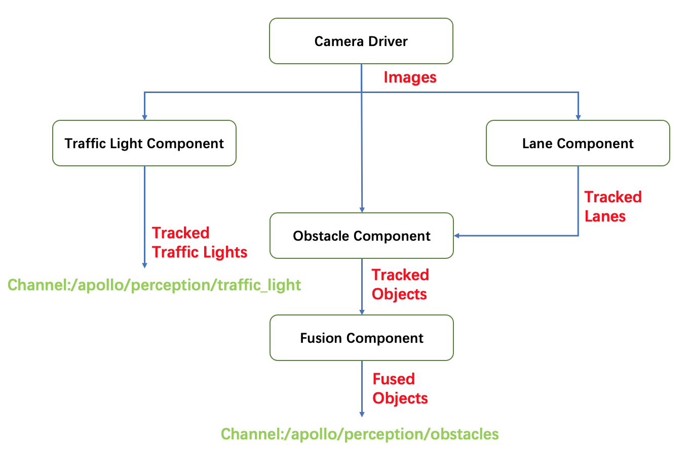
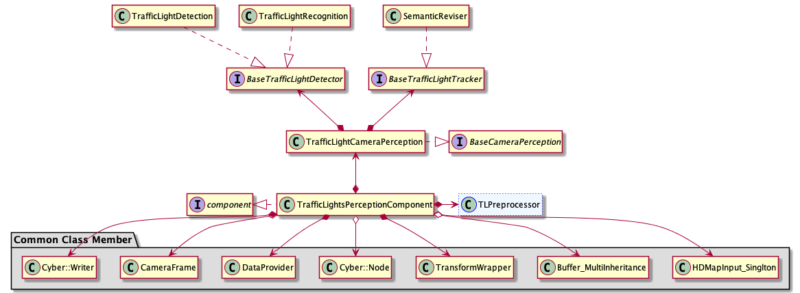

# 如何添加新的camera检测算法

Perception中的camera数据流如下：
    

本篇文档所介绍的camera检测算法分为三种，分别为针对交通信号灯的检测算法，针对车道线的检测算法和针对障碍物的检测算法。这三种检测算法分别位于图中的Traffic_light, Lane和Obstacle三大Component中。各Component的架构如下：
交通信号灯感知:
    

车道线感知:
    

障碍物感知:
    


从以上结构中可以清楚地看到,各个component都有自己的抽象类成员 `base_XXX_detector`。对应的检测算法作为 `base_XXX_detector` 的不同的派生类，继承各自的基类实现算法的部署。由于各detector基类在结构上非常相似，下面将以 ` base_obstacle_detector` 为例介绍如何基于当前结构添加新的camera障碍物检测算法。新增交通信号灯和车道线检测算法的步骤相同。


Apollo在Obstacle Detection中默认提供了3种camera检测算法--Smoke，Yolo和YoloV4，它们可以被轻松更改或替换为不同的算法。每种算法的输入都是经过预处理的图像信息，输出都是目标级障碍物信息。本篇文档将介绍如何引入新的Camera检测算法，添加新算法的步骤如下：

1. 定义一个继承基类 `base_obstacle_detector` 的类
2. 实现新类 `NewObstacleDetector`
3. 为新类 `NewObstacleDetector` 配置param的proto文件
4. 更新config文件使新的算法生效

为了更好的理解，下面对每个步骤进行详细的阐述:

## 定义一个继承基类 `base_obstacle_detector` 的类

所有的camera检测算法都必须继承基类`base_obstacle_detector`，它定义了一组接口。 以下是检测算法继承基类的示例:

```c++
namespace apollo {
namespace perception {
namespace camera {

class NewObstacleDetector : public BaseObstacleDetector {
 public:
  NewObstacleDetector();
  virtual ~NewObstacleDetector() = default;

  bool Init(const ObstacleDetectorInitOptions &options =
            ObstacleDetectorInitOptions()) override;

  bool Detect(const ObstacleDetectorOptions &options,
              CameraFrame *frame) override;

  std::string Name() const override;

};  // class NewObstacleDetector

}  // namespace camera
}  // namespace perception
}  // namespace apollo
```

基类 `base_obstacle_detector` 已定义好各虚函数签名，接口信息如下：

```c++
struct ObstacleDetectorInitOptions : public BaseInitOptions {
  std::shared_ptr<base::BaseCameraModel> base_camera_model = nullptr;
  Eigen::Matrix3f intrinsics;

  EIGEN_MAKE_ALIGNED_OPERATOR_NEW
} EIGEN_ALIGN16;

struct ObstacleDetectorOptions {};

struct CameraFrame {
  // timestamp
  double timestamp = 0.0;
  // frame sequence id
  int frame_id = 0;
  // data provider
  DataProvider *data_provider = nullptr;
  // calibration service
  BaseCalibrationService *calibration_service = nullptr;
  // hdmap struct
  base::HdmapStructPtr hdmap_struct = nullptr;
  // tracker proposed objects
  std::vector<base::ObjectPtr> proposed_objects;
  // segmented objects
  std::vector<base::ObjectPtr> detected_objects;
  // tracked objects
  std::vector<base::ObjectPtr> tracked_objects;
  // feature of all detected object ( num x dim)
  // detect lane mark info
  std::vector<base::LaneLine> lane_objects;
  std::vector<float> pred_vpt;
  std::shared_ptr<base::Blob<float>> track_feature_blob = nullptr;
  std::shared_ptr<base::Blob<float>> lane_detected_blob = nullptr;
  // detected traffic lights
  std::vector<base::TrafficLightPtr> traffic_lights;
  // camera intrinsics
  Eigen::Matrix3f camera_k_matrix = Eigen::Matrix3f::Identity();
  // narrow to obstacle projected_matrix
  Eigen::Matrix3d project_matrix = Eigen::Matrix3d::Identity();
  // camera to world pose
  Eigen::Affine3d camera2world_pose = Eigen::Affine3d::Identity();
  EIGEN_MAKE_ALIGNED_OPERATOR_NEW
} EIGEN_ALIGN16;  // struct CameraFrame
```

## 实现新类 `NewObstacleDetector`

为了确保新的检测算法能顺利工作，`NewObstacleDetector` 至少需要重写 `base_obstacle_detector` 中定义的接口Init(),Detect()和Name()。其中Init()函数负责完成加载配置文件，初始化类成员等工作；而Detect()则负责实现算法的主体流程。一个具体的`NewObstacleDetector.cc`实现示例如下：

```c++
namespace apollo {
namespace perception {
namespace camera {

bool NewObstacleDetector::Init(const ObstacleDetectorInitOptions &options) {
    /*
    你的算法初始化部分
    */
}

bool NewObstacleDetector::Detect(const ObstacleDetectorOptions &options,
                                 CameraFrame *frame) {
    /*
    你的算法实现部分
    */
}

std::string NewObstacleDetector::Name() const {
    /*
    返回你的检测算法名称
    */
}

REGISTER_OBSTACLE_DETECTOR(NewObstacleDetector); //注册新的camera_obstacle_detector

}  // namespace camera
}  // namespace perception
}  // namespace apollo
```


## 为新类 `NewObstacleDetector` 配置param的proto文件

按照下面的步骤添加新camera检测算法的参数信息:

1. 根据算法要求为新camera检测算法配置param的`proto`文件。当然，如果参数适配，您也可以直接使用现有的`proto`文件，或者对现有`proto`文件进行更改。作为示例，可以参考以下位置的`smoke`的`proto`定义：`modules/perception/camera/lib/obstacle/detector/smoke/proto/smoke.proto`。定义完成后在文件头部输入以下内容：

    ```protobuf
    syntax = "proto2";
    package apollo.perception.camera.NewObstacleDetector;

    //你的param参数
    ```

2. 参考 `yolo_obstacle_detector` 在目录 `modules/perception/production/data/perception/camera/models/` 中创建 `newobstacledetector` 文件夹，并根据需求创建 `*.pt` 文件：

    ```
    注意：此处 "*.pt" 文件应对应步骤1中的proto文件格式.
    ```

## 更新config文件使新的算法生效

要使用Apollo系统中的新camera检测算法，需要根据需求依次对以下config文件进行配置:

1. 参考如下内容更新 `modules/perception/production/conf/perception/camera/obstacle.pt`文件,将之前步骤中新建的 `*.pt` 配置到加载路径中:

    ```protobuf
    detector_param {
    plugin_param{
        name : "NewObstacleDetector"
        root_dir : "/apollo/modules/perception/production/data/perception/camera/models/newobstacledetector"
        config_file : "*.pt"
    }
    camera_name : "front_12mm"
    }
    ```

2. 若需要对步骤1中 `detector_param` 的结构更新，或需要新增其他 `_param`，可在 `modules/perception/camera/app/proto/perception.proto` 文件中操作:

    ```protobuf
    message PluginParam {
    optional string name = 1;
    optional string root_dir = 2;
    optional string config_file = 3;
    }
    message DetectorParam {
    optional PluginParam plugin_param = 1;
    optional string camera_name = 2;
    }
    ```

3. 若步骤1中不直接使用 `obstacle.pt` 文件，而使用其他新建的 `*.pt` 文件，则需要更改 `modules/perception/production/conf/perception/camera/fusion_camera_detection_component.pb.txt`. 其对应的 `proto` 文件为 `modules/perception/onboard/proto/fusion_camera_detection_component.proto`：

    ```protobuf
    camera_obstacle_perception_conf_dir : "/apollo/modules/perception/production/conf/perception/camera"
    camera_obstacle_perception_conf_file : "NewObstacleDetector.pt"
    ```

在完成以上步骤后，您的新camera检测算法便可在Apollo系统中生效。
