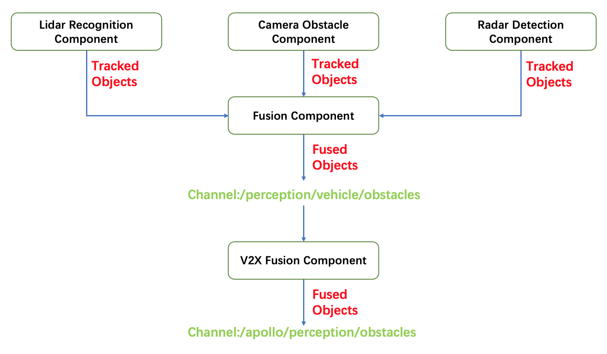
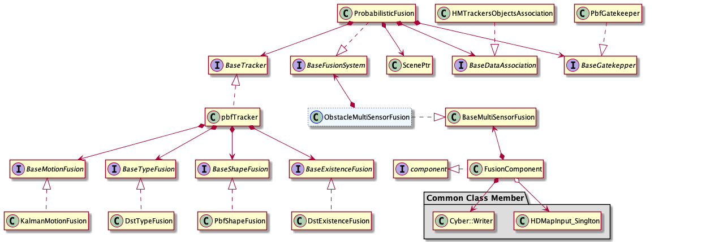

# 如何添加新的fusion融合系统

Perception中的详细模型结构如下：


本篇文档所介绍的fusion融合系统位于图中的Fusion Component中。当前Fusion Component的架构如下：


从以上结构中可以清楚地看到fusion融合系统是位于Fusion Component的 `ObstacleMultiSensorFusion` 中的抽象成员类 `BaseFusionSystem` 的派生类。下面将详细介绍如何基于当前结构添加新的fusion融合系统。

Apollo默认提供了1种fusion融合系统 -- Probabilistic Fusion，它可以轻松更改或替换为不同的系统。每种系统的输入都是各传感器检测匹配跟踪后的目标级障碍物信息，输出都是融合匹配跟踪后的目标级障碍物信息。本篇文档将介绍如何引入新的fusion融合系统，添加新系统的步骤如下：

1. 定义一个继承基类 `base_fusion_system` 的类
2. 实现新类 `NewFusionSystem`
3. 为新类 `NewFusionSystem` 配置config的proto文件
4. 更新config文件使新的系统生效

为了更好的理解，下面对每个步骤进行详细的阐述:

## 定义一个继承基类 `base_fusion_system` 的类

所有的fusion融合系统都必须继承基类 `base_fusion_system`，它定义了融合系统的基础成员及其接口。 以下是融合系统继承基类的示例:

```c++
namespace apollo {
namespace perception {
namespace fusion {

class NewFusionSystem : public BaseFusionSystem {
 public:
  NewFusionSystem();
  ~NewFusionSystem();

  NewFusionSystem(const NewFusionSystem&) = delete;
  NewFusionSystem& operator=(const NewFusionSystem&) = delete;

  bool Init(const FusionInitOptions& init_options) override;

  bool Fuse(const FusionOptions& options,
            const base::FrameConstPtr& sensor_frame,
            std::vector<base::ObjectPtr>* fused_objects) override;

  std::string Name() const override;

};  // class NewFusionSystem

}  // namespace fusion
}  // namespace perception
}  // namespace apollo
```

基类 `base_fusion_system` 已定义好各虚函数签名，接口信息如下：

```c++
struct FusionInitOptions {
  std::vector<std::string> main_sensors;
};

struct FusionOptions {};

struct alignas(16) Frame {
  EIGEN_MAKE_ALIGNED_OPERATOR_NEW

  Frame() { sensor2world_pose.setIdentity(); }

  void Reset() {
    timestamp = 0.0;
    objects.clear();
    sensor2world_pose.setIdentity();
    sensor_info.Reset();
    lidar_frame_supplement.Reset();
    radar_frame_supplement.Reset();
    camera_frame_supplement.Reset();
  }
  // @brief sensor information
  SensorInfo sensor_info;

  double timestamp = 0.0;
  std::vector<std::shared_ptr<Object>> objects;
  Eigen::Affine3d sensor2world_pose;

  // sensor-specific frame supplements
  LidarFrameSupplement lidar_frame_supplement;
  RadarFrameSupplement radar_frame_supplement;
  CameraFrameSupplement camera_frame_supplement;
  UltrasonicFrameSupplement ultrasonic_frame_supplement;
};

typedef std::shared_ptr<Frame> FramePtr;
typedef std::shared_ptr<const Frame> FrameConstPtr;

struct alignas(16) Object {
  EIGEN_MAKE_ALIGNED_OPERATOR_NEW
  Object();
  std::string ToString() const;
  void Reset();
  int id = -1;
  PointCloud<PointD> polygon;
  Eigen::Vector3f direction = Eigen::Vector3f(1, 0, 0);
  float theta = 0.0f;
  float theta_variance = 0.0f;
  Eigen::Vector3d center = Eigen::Vector3d(0, 0, 0);
  Eigen::Matrix3f center_uncertainty;
  Eigen::Vector3f size = Eigen::Vector3f(0, 0, 0);
  Eigen::Vector3f size_variance = Eigen::Vector3f(0, 0, 0);
  Eigen::Vector3d anchor_point = Eigen::Vector3d(0, 0, 0);

  ObjectType type = ObjectType::UNKNOWN;
  std::vector<float> type_probs;

  ObjectSubType sub_type = ObjectSubType::UNKNOWN;
  std::vector<float> sub_type_probs;

  float confidence = 1.0f;
  int track_id = -1;
  Eigen::Vector3f velocity = Eigen::Vector3f(0, 0, 0);
  Eigen::Matrix3f velocity_uncertainty;
  bool velocity_converged = true;
  float velocity_confidence = 1.0f;
  Eigen::Vector3f acceleration = Eigen::Vector3f(0, 0, 0);
  Eigen::Matrix3f acceleration_uncertainty;

  double tracking_time = 0.0;
  double latest_tracked_time = 0.0;
  MotionState motion_state = MotionState::UNKNOWN;
  std::array<Eigen::Vector3d, 100> drops;
  std::size_t drop_num = 0;
  bool b_cipv = false;
  CarLight car_light;
  LidarObjectSupplement lidar_supplement;
  RadarObjectSupplement radar_supplement;
  CameraObjectSupplement camera_supplement;
  FusionObjectSupplement fusion_supplement;
};

using ObjectPtr = std::shared_ptr<Object>;
using ObjectConstPtr = std::shared_ptr<const Object>;
```

## 实现新类 `NewFusionSystem`

为了确保新的融合系统能顺利工作， `NewFusionSystem` 至少需要重写 `base_fusion_system` 中定义的接口Init(), Fuse()和Name()函数。其中Init()函数负责完成加载配置文件，初始化类成员等工作；而Fuse()函数则负责实系统的主体流程。一个具体的`NewFusionSystem.cc`实现示例如下：

```c++
namespace apollo {
namespace perception {
namespace fusion {

bool NewFusionSystem::Init(const FusionInitOptions& init_options) {
    /*
    你的系统初始化部分
    */
}

bool NewFusionSystem::Fuse(const FusionOptions& options,
                           const base::FrameConstPtr& sensor_frame,
                           std::vector<base::ObjectPtr>* fused_objects) {
    /*
    你的系统实现部分
    */
}

std::string NewFusionSystem::Name() const {
    /*
    返回你的融合系统名称
    */
}

FUSION_REGISTER_FUSIONSYSTEM(NewFusionSystem); //注册新的fusion_system

}  // namespace fusion
}  // namespace perception
}  // namespace apollo
```


## 为新类 `NewFusionSystem` 配置config的proto文件

按照下面的步骤添加新fusion融合系统的配置信息:

1. 根据系统要求为新fusion融合系统配置config的`proto`文件。作为示例，可以参考以下位置的`probabilistic_fusion_config`的`proto`定义：`modules/perception/proto/probabilistic_fusion_config.proto`.

2. 定义新的`proto`之后，例如`newfusionsystem_config.proto`，定义完成后在文件头部输入以下内容：

    ```protobuf
    syntax = "proto2";
    package apollo.perception.fusion;

    message NewFusionSystemConfig {
        double parameter1 = 1;
        int32 parameter2 = 2;
    }
    ```

3. 参考如下内容更新 `modules/perception/production/conf/perception/fusion/config_manager.config`文件:

    ```protobuf
    model_config_path: "./conf/perception/fusion/modules/newfusionsystem.config"
    ```

4. 参考同级别目录下 `modules/probabilistic_fusion.config` 内容创建 `newfusionsystem.config`:

    ```protobuf
    model_configs {
        # NewFusionSystem model.
        name: "NewFusionSystem"
        version: "1.0.0"
        string_params {
            name: "root_dir"
            value: "./data/perception/fusion/"
        }
        string_params {
            name: "config_file"
            value: "newfusionsystem.pt"
        }
    }
    ```

5. 参考 `probabilistic_fusion.pt` 在目录 `modules/perception/production/data/perception/fusion/` 中创建 `newfusionsystem.pt` 文件：

    ```
    注意：此处 "*.pt" 文件应对应步骤1，2中的proto文件格式.
    ```

## 更新config文件使新的系统生效

要使用Apollo系统中的新fusion融合系统，需要将 `modules/perception/production/data/perception/fusion/fusion_component_conf.pb.txt` 中的 `fusion_method` 值字段改为 "NewFusionSystem"。

在完成以上步骤后，您的新fusion融合系统便可在Apollo系统中生效。
